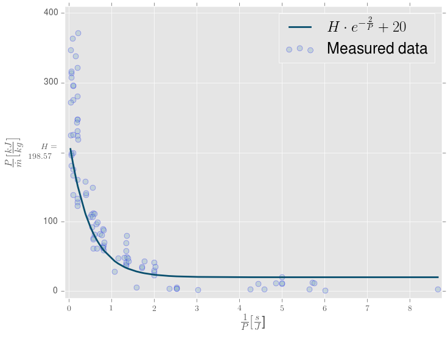

# termolabHandbook

# Installation

```bash
$ git clone https://github.com/srydell/termolabHandbook.git

$ cd termolabHandbook

$ pip3 install -r requirements.txt
```

Running the python script would result in the following plot.



# Modification

The labs will most likely change over the years. If there are any mistakes made in this handbook, or anything you would like to add, please make a pull request and correct it.
