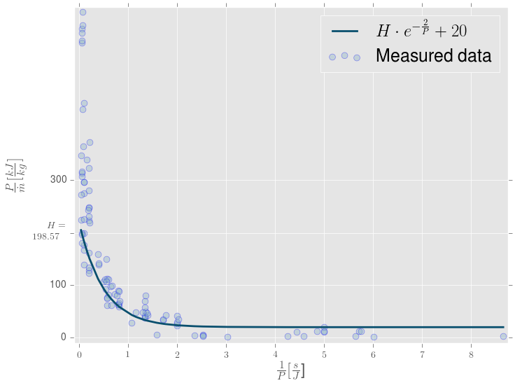

# termolabHandbook

# Installation

```bash
$ git clone https://github.com/srydell/termolabHandbook.git

$ cd termolabHandbook

$ pip3 install -r requirements.txt
```

Running the python script would result in the following plot.


